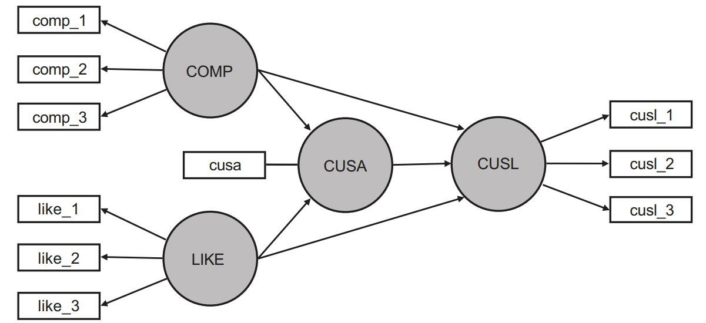

```{r setup, include=FALSE}
knitr::opts_chunk$set(echo = TRUE)
```

Specifically, it is the so-called Eberl’s (2010) corporate reputation model. The goal of the model is to explain the effects of corporate reputation on customer satisfaction (CUSA) and, ultimately, customer loyalty(CUSL).  Corporate reputation represents a company’s overall evaluation by its stakeholders (Helm, Eggert, & Garnefeld, 2010). This construct is measured using two dimensions. One dimension represents cognitive evaluations of the company, which is the company’s competence (COMP). The second dimension captures affective judgments, which determine the company’s likeability (LIKE). Research has shown that the model performs favorably (in terms of convergent validity and
predictive validity) compared to alternative reputation measures (Sarstedt,Wilczynski, & Melewar, 2013)

In summary, the simple corporate reputation model has two main **theoretical components**: 

*(1) the target constructs of interest – namely, CUSA and CUSL(endogenous constructs), and
*(2) the two corporate reputation dimensions COMP

and LIKE (exogenous constructs), which are key determinants of the target constructs. . Figure  shows the constructs and their relationships.



And the descriptions on the constructs and indicators


Now that you are familiar with the reputation model, we will demonstrate the
syntax used by SEMinR. Briefly, there are four steps to specify and estimate a
structural equation model using SEMinR:

1. Loading and cleaning the data
2. Specifying the measurement models
3. Specifying the structural model
4. Estimating, bootstrapping, and summarizing the model

```{r echo=FALSE}
library(seminr)
```

# 1 Loading and cleaning the data

```{r}
load("D:/DataScience/stat_SEM/data/corp_rep_data.rda")
#corp_rep_data
head(corp_rep_data)

```


# 2 Specifying the measurement models

Path models are made up of two elements: (1) the measurement models (also called outer models in PLS-SEM), which describe the relationships between the latent variables and their measures (i.e., their indicators), and (2) the structural model(also called the inner model in PLS-SEM), which describes the relationships between the latent variables. We begin with describing how to specify the **measurement models**.

The basis for determining the relationships between constructs and their corresponding indicator variables is measurement theory. A sound measurement theory is a necessary condition to obtain useful results from any PLS-SEM analysis. Hypothesis tests involving the structural relationships among constructs will only be as reliable or valid as the construct measures.


```{r}
# Create measurement model
simple_mm <- constructs(
composite("COMP", multi_items("comp_", 1:3)),
composite("LIKE", multi_items("like_", 1:3)),
composite("CUSA", single_item("cusa")),
composite("CUSL", multi_items("cusl_", 1:3)))

```

# 3 Specifying the Structural Model

With our measurement model specified, we now specify the structural model. When a structural model is being developed, two primary issues need to be considered: the **sequence** of the constructs and the **relationships** between them. Both issues are critical to the concept of modeling because they represent the hypotheses and their relationships to the theory being tested.

In most cases, researchers examine linear independent–dependent relationships between two or more constructs in the path model. Theory may suggest, however,that model relationships are more complex and involve mediation or moderation relationships. In the following section, we briefly introduce these different relationship types. 

```{r}
 #Create structural model
simple_sm <- relationships(
paths(from = c("COMP", "LIKE"), to = c("CUSA", "CUSL")),
paths(from = c("CUSA"), to = c("CUSL")))

```

# 4 Estimating, bootstrapping, and summarizing the model

## 4.1 Estimating the Model


After having specified the measurement and structural models, the next step is the model estimation using the PLS-SEM algorithm. For this task, the algorithm needs to determine the **scores of the constructs** that are used as input for (single and multiple) partial regression models within the path model. After the algorithm has calculated the construct scores, the scores are used to estimate each partial regression model in the path model. As a result, we obtain the estimates for all relationships in the measurement models (i.e., the indicator weights/loadings) and the structural model (i.e., the path coefficients).

---
The setup of the measurement models depends on whether the construct under consideration is modeled as reflective or formative. When a reflective measurement model is assumed for a construct, the indicator loadings are typically estimated through mode A. It estimates the relationship from the construct to each indicator based on a reflective measurement model that uses bivariate regressions (i.e., a single indicator variable represents the dependent variable, while the construct score represents the independent variable). As a result, we obtain correlations between the construct and each of its indicators (i.e., correlation weights), which become the indicator loadings. 

In contrast, when a formative measurement model is assumed for a construct, the indicator weights are typically estimated using multiple regression. More specifically, the measurement model estimation applies PLS-SEM’s mode B, in which the construct represents a dependent variable and its associated indicator variables are the multiple independent variables. As a result, we obtain regression weights for the relationships from the indicators to the construct, which represent the indicator weights. While the use of mode A (i.e., correlation weights) for reflective measurement models and mode B (i.e., regression weights) for formative measurement models represents the standard approach to estimate the relationships between the constructs and their indicators in PLS-SEM, researchers may choose a different mode per type of measurement model in special situations
(see also Hair et al., 2022; Rigdon, 2012)
---

Structural model calculations are executed as follows. The partial regressions for the structural model specify an endogenous construct as the dependent variable in a regression model. This endogenous construct’s direct predecessors (i.e., latent variables with a direct relationship leading to the specific endogenous construct)are the independent variables in a regression used to estimate the path coefficients.Hence, there is a partial regression model for every endogenous construct to estimate all the path coefficients in the structural model


All partial regression models are estimated by the PLS-SEM algorithm’s iterative procedures, which comprise two stages. In the first stage, the construct scores are estimated. Then, in the second stage, the final estimates of the indicator weights and loadings are calculated, as well as the structural model’s path coefficients and the resulting R2 values of the endogenous latent variables. A detailed description of the PLS-SEM algorithm’s stages (seealso Lohmöller, 1989).


```{r}

# Estimate the model
corp_rep_simple_model <- estimate_pls(data = corp_rep_data,
measurement_model = simple_mm,
structural_model = simple_sm,
inner_weights = path_weighting,
missing = mean_replacement,
missing_value = "-99")

```

## 4.2 Summarizing the Model
```{r}

# Summarize the model results
summary_simple_corp_rep <- summary(corp_rep_simple_model)
# Inspect the model’s path coefficients and the R^2 values
summary_simple_corp_rep$paths
# Inspect the construct reliability metrics
summary_simple_corp_rep$reliability
```


## 4.3 Bootstrapping the Model


```{r}
# Bootstrap the model
boot_simple_corp_rep <- bootstrap_model(seminr_model = corp_rep_simple_model,
nboot = 1000,
cores = NULL,
seed = 123)
# Store the summary of the bootstrapped model
sum_boot_simple_corp_rep <- summary(boot_simple_corp_rep)
# Inspect the bootstrapped structural paths
sum_boot_simple_corp_rep$bootstrapped_paths
# Inspect the bootstrapped indicator loadings
sum_boot_simple_corp_rep$bootstrapped_loadings

```