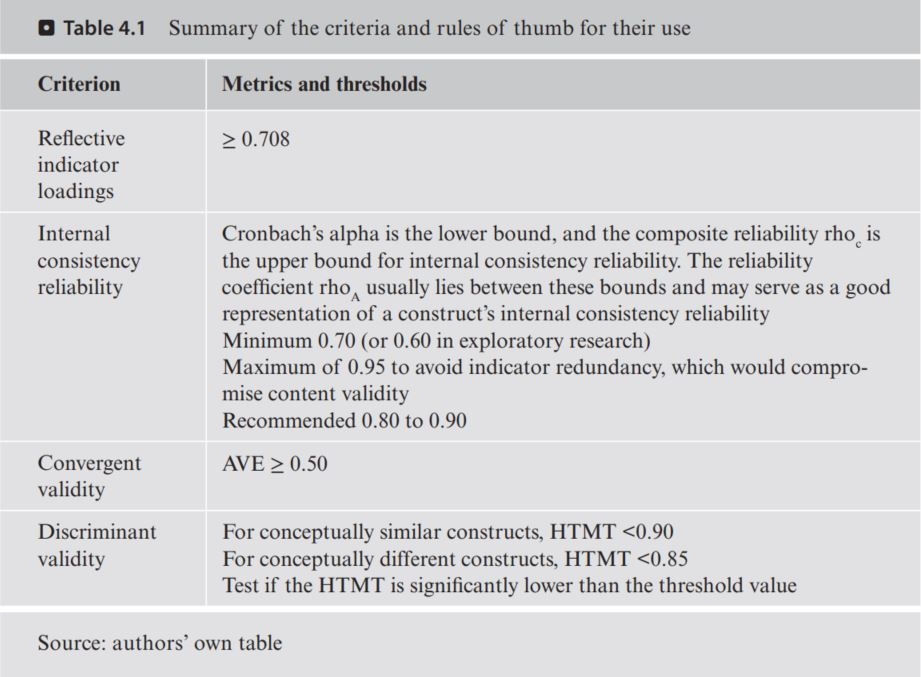

```{r setup, include=FALSE}
knitr::opts_chunk$set(echo = TRUE)
```

In the document, we need to understand:

1. The concept of indicator reliability
2. The different metrics for assessing internal consistency reliability
3. How to interpret the average variance extracted (AVE) as a measure of convergent validity
4. How to evaluate discriminant validity using the HTMT criterion
5. How to use SEMinR to assess reflectively measured constructs in the corporate
reputation example


# 1 Case Study Illustration: Reflective Measurement Models

```{r echo=FALSE}
library(seminr)
```


```{r}
load("D:/DataScience/stat_SEM/data/corp_rep_data.rda")
#corp_rep_data
#head(corp_rep_data)

# Create measurement model
corp_rep_mm <- constructs(
composite("COMP", multi_items("comp_", 1:3)),
composite("LIKE", multi_items("like_", 1:3)),
composite("CUSA", single_item("cusa")),
composite("CUSL", multi_items("cusl_", 1:3)))
# Create structural model
corp_rep_sm <- relationships(
paths(from = c("COMP", "LIKE"), to = c("CUSA", "CUSL")),
paths(from = c("CUSA"), to = c("CUSL")))
# Estimating the model
corp_rep_pls_model <- estimate_pls(data = corp_rep_data,  #  maxIt = 300
measurement_model = corp_rep_mm,
structural_model = corp_rep_sm,
missing = mean_replacement,
missing_value = "-99")
# Summarize the model results
summary_corp_rep <- summary(corp_rep_pls_model)

```

## 1.1

Before analyzing the results, we advise to first check if the algorithm converged (i.e., the stop criterion of the algorithm was reached and not the maximum number of iterations. To do so, it is necessary to inspect by the line below. So the result is less than maximum number of iterations.
```{r}
# Iterations to converge
summary_corp_rep$iterations
```
If the PLS-SEM algorithm does not converge in fewer than 300 iterations, which is the default setting in most PLS-SEM software, the algorithm could not find a stable solution. This kind of situation almost never occurs. But if it does occur,there are two possible causes: 

* (1) The selected stop criterion is set at a very small
level (e.g., 1.0E-10 as opposed to the standard of 1.0E-7), so that small changes in
the coefficients of the measurement models prevent the PLS-SEM algorithm from
stopping, or 
* (2) there are problems with the data and it needs to be checked carefully. For example, 
  * data problems may occur if the sample size is too small or 
  * if the responses to an indicator include many identical values (i.e., the same data points,which results in insufficient variability, error message is singular matrix).


## 1.2 

Here, we inspect the summary_corp_rep object to obtain statistics relevant for assessing the construct measures’ internal consistency reliability, convergent validity, and discriminant validity. The simple corporate reputation model contains three constructs with reflective measurement models (i.e., COMP, CUSL,and LIKE) as well as a single-item construct (CUSA). For the reflective measurement model, we need to estimate the relationships between the reflectively measured constructs and their indicators (i.e., loadings)

### indicator loadings and indicator reliability

```{r}
# Inspect the indicator loadings
summary_corp_rep$loadings
# Inspect the indicator reliability
summary_corp_rep$loadings^2

```
All indicator loadings of the reflectively measured constructs COMP, CUSL, and LIKE are well above the threshold value of **0.708** (Hair, Risher, Sarstedt, & Ringle, 2019), which suggests sufficient levels of indicator reliability. The indicator comp_2(loading, 0.798) has the smallest indicator-explained variance with a value of 0.638 (= 0.7982^2), while the indicator cusl_2 (loading, 0.917^2) has the highest explained variance, with a value of 0.841 (= 0.9172^2) – both values are well above the threshold value of **0.5**.


### construct measures’ internal consistency reliability(Alpha, rhoC, and rhoA), convergent validity
```{r}
# Inspect the composite reliability
summary_corp_rep$reliability
# Plot the reliabilities of constructs
plot(summary_corp_rep$reliability)
```
With rhoA values of 0.832 (COMP), 0.839 (CUSL), and 0.836 (LIKE), all three reflectively measured constructs have high levels of **internal consistency reliability**.

the results for **Cronbach’s alpha** (0.776 for COMP, 0.831 for CUSL, and 0.831 for LIKE) and the **composite reliability rhoc** (0.865 for
COMP, 0.899 for CUSL, and 0.899 for LIKE) are above the 0.70 threshold (Hairet al., 2019), indicating that all construct measures are reliable.

**Convergent validity assessment** is based on the average variance extracted (AVE) values (Hair et al., 2019), which can also be accessed by summary_corp_
rep$reliability. . Figure 4.5 shows the AVE values along with the internal consistency reliability values. In this example, the AVE values of COMP (0.681),CUSL (0.748), and LIKE (0.747) are well above the required minimum level of 0.50 (Hair et al., 2019). Thus, the measures of the three reflectively measured constructs have high levels of convergent validity


### discriminant validity

According to the Fornell–Larcker criterion (Fornell & Larcker, 1981), the square root of the AVE of each construct should be higher than the construct’s highest correlation with any other construct in the model (this notion is identical to comparing the AVE with the squared correlations between the constructs). 
```{r}
# Table of the FL criteria
summary_corp_rep$validity$fl_criteria

```
It shows the results of the Fornell–Larcker criterion assessment with the square root of the reflectively measured constructs’ AVE on the diagonal and the correlations between the constructs in the off-diagonal position. For example,the reflectively measured construct COMP has a value of 0.825 for the square root of its AVE, which needs to be compared with all correlation values in the column of COMP (i.e., 0.645, 0.436, and 0.450). Note that for CUSA, the comparison makes no sense, as the AVE of a single-item construct is 1.000 by design. Overall, the square roots of the AVEs for the reflectively measured constructs COMP (0.825), CUSL (0.865), and LIKE (0.864) are all higher than the correlations of these constructs with other latent variables in the PLS path model


Note that while frequently used in the past, the Fornell–Larcker criterion does not allow for reliably detecting discriminant validity issues. Specifically, in light of the Fornell–Larcker criterion’s poor performance in detecting discriminant validity problems (Franke & Sarstedt, 2019; Henseler et al., 2015), any violation indicated by the criterion should be considered a severe issue. The primary criterion for discriminant validity assessment is the HTMT criterion,

```{r}
# HTMT criterion
summary_corp_rep$validity$htmt
```
As can be seen, all HTMT values are clearly lower than the more conservative threshold value of 0.85 (Henseler et al., 2015), even for CUSA and CUSL, which, from a conceptual viewpoint, are very similar. Recall that the threshold value for conceptually similar constructs, such as CUSA and CUSL or COMP and LIKE, is 0.90.


In addition to examining the HTMT values, researchers should test whether the HTMT values are significantly different from 1 or a lower threshold, such as 0.9 or even 0.85. This analysis requires computing bootstrap confidence intervals obtained by running the bootstrapping procedure.

```{r}
# Bootstrap the model
boot_corp_rep <- bootstrap_model(seminr_model = corp_rep_pls_model, nboot = 1000)
sum_boot_corp_rep <- summary(boot_corp_rep, alpha = 0.10)
# Extract the bootstrapped HTMT
sum_boot_corp_rep$bootstrapped_HTMT

```

As can be seen, the confidence intervals’ upper boundaries, in our example, are always lower than the threshold value of 0.90. To summarize, the bootstrap confidence interval results of the HTMT criterion clearly demonstrate the discriminant validity of the constructs and should be favored above the inferior Fornell–Larcker criterion.


## 2 Theories on Evaluation of Reflective Measurement Models

### 2.1 Indicator Reliability

The first step in reflective measurement model assessment involves examining how much of each indicator’s variance is explained by its construct, which is indicative of indicator reliability. To compute an indicator’s explained variance, we need to square the **indicator loading**, which is the bivariate **correlation** between **indicator** and **construct**. As such, the indicator reliability indicates the **communality** of an indicator. Indicator loadings above 0.708 are recommended, since they indicate that the construct **explains more than 50 percent** of the indicator’s variance, thus providing acceptable indicator reliability

Researchers frequently obtain weaker indicator loadings (< 0.708) for their measurement models in social science studies, especially when newly developed scales are used (Hulland, 1999). 

Rather than automatically eliminating indicators when their loading is below 0.70, researchers should carefully examine the effects of indicator removal on other reliability and validity measures. Generally, indicators with loadings between 0.40 and 0.708 should be considered for removal **only when** deleting the indicator leads to an increase in the internal consistency reliability or convergent validity (discussed in the next sections) above the suggested threshold value. **Another consideration** in the decision of whether to delete an indicator is the extent to which its removal affects **content validity**, which refers to the extent to which a measure represents all facets of a given construct. As a consequence, indicators with weaker loadings are sometimes retained. Indicators with very low loadings (below 0.40) should, however, always be eliminated from the measurement model (Hair, Hult, Ringle, & Sarstedt, 2022)


### 2.2 Internal Consistency Reliability

Internal consistency reliability is the extent to which indicators measuring the same construct are associated with each other. One of the primary measures used in PLS-SEM is Jöreskog’s (1971) composite reliability **rhoc**. Higher values indicate higher levels of reliability. For example, reliability values between **0.60 and 0.70** are considered “acceptable in exploratory research,”whereas values between **0.70 and 0.90** range from “satisfactory to good.” Values **above 0.90 (and definitely above 0.95)** are problematic, since they indicate that the indicators are redundant, thereby reducing construct validity (Diamantopoulos,Sarstedt, Fuchs, Wilczynski, & Kaiser, 2012). Reliability values of 0.95 and above also suggest the possibility of undesirable response patterns (e.g., straight-lining),thereby triggering inflated correlations among the error terms of the indicators.

Cronbach’s alpha is another measure of internal consistency reliability, which assumes the same thresholds as the composite reliability (rhoc). A major limitation of Cronbach’s alpha, however, is that it assumes all indicator loadings are the same in the population (also referred to as tau-equivalence). The violation of this assumption manifests itself in lower reliability values than those produced by rhoc. Nevertheless, researchers have shown that even in the absence of tau-equivalence,Cronbach’s alpha is an **acceptable lower-bound approximation** of the true internal consistency reliability (Trizano-Hermosilla & Alvarado, 2016).


While Cronbach’s alpha is rather conservative, the composite reliability rhoc may be too liberal, and the construct’s true reliability is typically viewed as within these two extreme values. As an alternative and building on Dijkstra (2010), subsequent research has proposed the exact (or consistent) reliability coefficient rhoA (Dijkstra, 2014; Dijkstra & Henseler, 2015). The reliability coefficient **rhoA** usually **lies between** the conservative Cronbach’s alpha and the liberal composite reliability and is therefore considered and acceptable compromise between these two measures.


### 2.3 Convergent Validity

Convergent validity is the extent to which the construct converges in order to explain the variance of its indicators. The metric used for evaluating a construct’s convergent validity is the average variance extracted (AVE) for all indicators on each construct. The AVE is defined as the grand mean value of the squared loadings of the indicators associated with the construct (i.e., the sum of the squared loadings divided by the number of indicators). Therefore, the AVE is equivalent to the communality of a construct. The minimum acceptable AVE is 0.50 – an AVE of 0.50 or higher indicates the construct explains 50 percent or more of the indicators’ variance that make up the construct (Hair et al., 2022).


### 2.4 Discriminant Validity

This metric measures the extent to which a construct is empirically distinct from other constructs in the structural model. 

The HTMT is defined as the mean value of the indicator correlations across constructs (i.e., the heterotrait–heteromethod correlations) relative to the (geometric) mean of the average correlations for the indicators measuring the same construct (i.e., the monotrait–heteromethod correlations).

Discriminant validity problems are present when HTMT values are high. Henseler et al. (2015) propose a threshold value of 0.90 for structural models with
constructs that are conceptually very similar, such as cognitive satisfaction, affective satisfaction, and loyalty. In such a setting, an HTMT value above 0.90 would suggest that discriminant validity is not present. But when constructs are conceptually more distinct, a lower, more conservative, threshold value is suggested, such as 0.85 (Henseler et al., 2015).

In addition, bootstrap confidence intervals can be used to test if the HTMT is significantly different from 1.0 (Henseler et al., 2015) or a lower threshold value,such as 0.9 or 0.85, which should be defined based on the study context (Franke &Sarstedt, 2019). 


### 2.5 Summary





