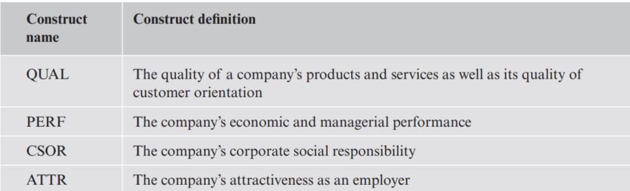
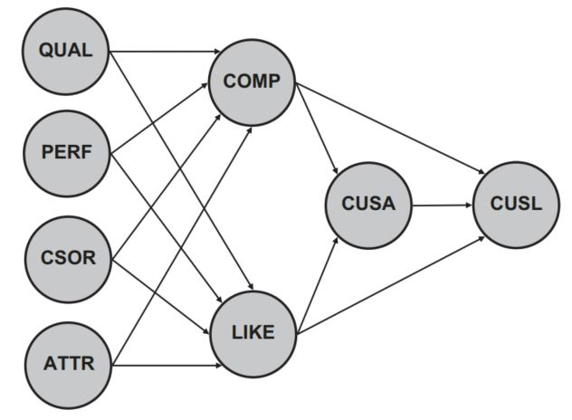
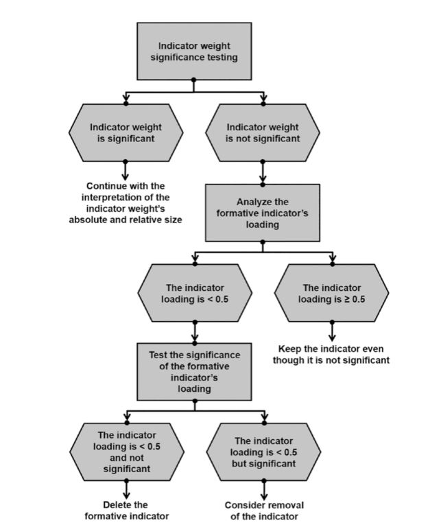
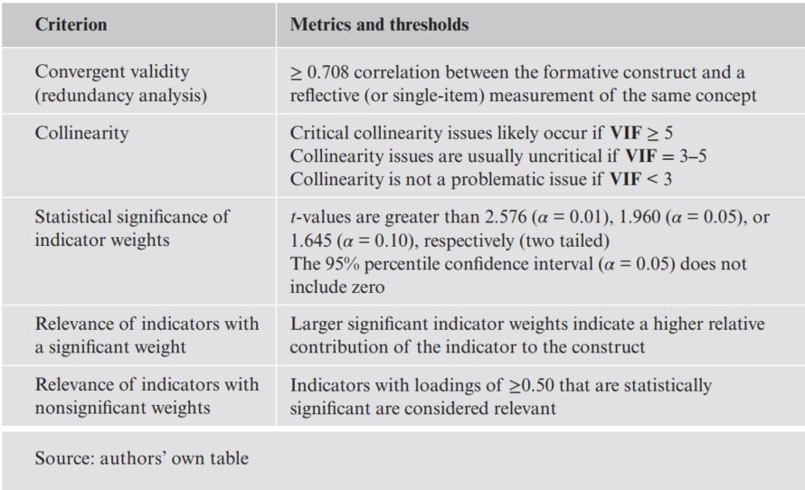

```{r setup, include=FALSE}
knitr::opts_chunk$set(echo = TRUE)
```

In the document, we will walk through the aspects in

1. The concept of redundancy analysis and how to apply it to evaluate convergent
validity
2. Collinearity, its implications, and how to assess it
3. Significance testing using bootstrapping and bootstrap confidence intervals
4. How to assess formative measurement models using SEMinR


# 1 Case Study Illustration: Formative Measurement Models


```{r echo=FALSE, out.width='100%'}


```

Don't forget estimate the minimum sample size

```{r echo=FALSE}
library(seminr)
```


## 1.1 Model Setup and Estimation

```{r}
load("D:/DataScience/stat_SEM/data/corp_rep_data.rda")
#corp_rep_data
#head(corp_rep_data)


# Create measurement model
corp_rep_mm_ext <- constructs(
composite("QUAL", multi_items("qual_", 1:8), weights = mode_B),
composite("PERF", multi_items("perf_", 1:5), weights = mode_B),
composite("CSOR", multi_items("csor_", 1:5), weights = mode_B),
composite("ATTR", multi_items("attr_", 1:3), weights = mode_B),
composite("COMP", multi_items("comp_", 1:3)),
composite("LIKE", multi_items("like_", 1:3)),
composite("CUSA", single_item("cusa")),
composite("CUSL", multi_items("cusl_", 1:3))
)
# Create structural model
corp_rep_sm_ext <- relationships(
paths(from = c("QUAL", "PERF", "CSOR", "ATTR"), to = c("COMP", "LIKE")),
paths(from = c("COMP", "LIKE"), to = c("CUSA", "CUSL")),
paths(from = c("CUSA"), to = c("CUSL"))
)
# Estimate the model
corp_rep_pls_model_ext <- estimate_pls(
data = corp_rep_data,
measurement_model = corp_rep_mm_ext,
structural_model = corp_rep_sm_ext,missing = mean_replacement,
missing_value = "-99")
# Summarize the model results
summary_corp_rep_ext <- summary(corp_rep_pls_model_ext)

```

```{r}
#  The number of missing observations is reported in the descriptive statistic object nested within the summary return object

summary_corp_rep_ext$descriptives$statistics 

```
```{r}
# Iterations to converge
summary_corp_rep_ext$iterations
```
```{r}
# Bootstrap the model
boot_corp_rep_ext <- bootstrap_model(
seminr_model = corp_rep_pls_model_ext, nboot = 1000)
# Store the summary of the bootstrapped model
sum_boot_corp_rep_ext <- summary(boot_corp_rep_ext,alpha = 0.10)

```


## 1.2 Reflective Measurement Model Evaluation

An important characteristic of PLS-SEM is that the model estimates will change when any of the model relationships or variables are changed. We thus need to reassess the reflective measurement models to ensure that this portion of the model remains valid and reliable before continuing to evaluate the four new exogenous formative constructs. We then follow the reflective measurement model assessment procedure in last document


## 1.3 Formative Measurement Model Evaluation


**Note** that when designing a research study that includes formatively measured constructs, you need to include this type of global measure in the survey


### redundancy analysis

```{r}
# Redundancy analysis
# ATTR
# Create measurement model
ATTR_redundancy_mm <- constructs(
composite("ATTR_F", multi_items("attr_", 1:3), weights =
mode_B),
composite("ATTR_G", single_item("attr_global"))
)
# Create structural model
ATTR_redundancy_sm <- relationships(
paths(from = c("ATTR_F"), to = c("ATTR_G"))
)
# Estimate the model
ATTR_redundancy_pls_model <- estimate_pls(
data = corp_rep_data,
measurement_model = ATTR_redundancy_mm,
structural_model = ATTR_redundancy_sm,
missing = mean_replacement,
missing_value = "-99")
# Summarize the model
sum_ATTR_red_model <- summary(ATTR_redundancy_pls_model)
# CSOR

# Create measurement model
CSOR_redundancy_mm <- constructs(
composite("CSOR_F", multi_items("csor_", 1:5), weights =
mode_B),
composite("CSOR_G", single_item("csor_global"))
)
# Create structural model
CSOR_redundancy_sm <- relationships(
paths(from = c("CSOR_F"), to = c("CSOR_G"))
)
# Estimate the model
CSOR_redundancy_pls_model <- estimate_pls(
data = corp_rep_data,
measurement_model = CSOR_redundancy_mm,
structural_model = CSOR_redundancy_sm,
missing = mean_replacement,
missing_value = "-99")
# Summarize the model
sum_CSOR_red_model <- summary(CSOR_redundancy_pls_model)


# PERF
# Create measurement model
PERF_redundancy_mm <- constructs(
composite("PERF_F", multi_items("perf_", 1:5), weights = mode_B),
composite("PERF_G", single_item("perf_global"))
)
# Create structural model
PERF_redundancy_sm <- relationships(
paths(from = c("PERF_F"), to = c("PERF_G"))
)
# Estimate the model
PERF_redundancy_pls_model <- estimate_pls(
data = corp_rep_data,
measurement_model = PERF_redundancy_mm,
structural_model = PERF_redundancy_sm,
missing = mean_replacement,
missing_value = "-99")
# Summarize the model
sum_PERF_red_model <- summary(PERF_redundancy_pls_model)


# QUAL
# Create measurement model
QUAL_redundancy_mm <- constructs(
composite("QUAL_F", multi_items("qual_", 1:8), weights =
mode_B),
composite("QUAL_G", single_item("qual_global"))
)
# Create structural model
QUAL_redundancy_sm <- relationships(
paths(from = c("QUAL_F"), to = c("QUAL_G"))
)
# Estimate the model
QUAL_redundancy_pls_model <- estimate_pls(data = corp_rep_data,
measurement_model = QUAL_redundancy_mm,
structural_model = QUAL_redundancy_sm,
missing = mean_replacement,
missing_value = "-99")
# Summarize the model
sum_QUAL_red_model <- summary(QUAL_redundancy_pls_model)


# Check the path coefficients for convergent validity
sum_ATTR_red_model$paths
sum_CSOR_red_model$paths
sum_PERF_red_model$paths
sum_QUAL_red_model$paths

```


It shows the results for the redundancy analysis of the four formatively measured constructs. For the ATTR construct, this analysis yields a **path coefficient** of 0.874, which is above the recommended threshold of 0.708, thus providing support for the formatively measured construct’s convergent validity. The redundancy analyses of CSOR, PERF, and QUAL yield estimates of 0.857, 0.811, and 0.805, respectively. Thus, all formatively measured constructs exhibit convergent validity.


### collinearity

```{r}

# Collinearity analysis
summary_corp_rep_ext$validity$vif_items

```

According to the results above, qual_3 has the highest VIF value (2.269).Hence, all VIF values are uniformly below the conservative **threshold value of 3**. We therefore conclude that collinearity does not reach critical levels in any of the formative measurement models and is not an issue for the estimation of the extended corporate reputation model


### indicator weights for their significance and relevance

We first consider the significance of the indicator weights by means of bootstrapping. 

```{r}

# Bootstrap the model
# seminr_model is the SEMinR model to be bootstrapped
# nboot is the number of bootstrap iterations to run
# cores is the number of cpu cores to use
# in multicore bootstrapping
# parallel::detectCores() allows for using
# the maximum cores on your device
# seed is the seed to be used for making bootstrap replicable


set.seed(34325345)

boot_corp_rep_ext <- bootstrap_model(seminr_model = corp_rep_pls_model_ext,
nboot = 1000, # default setting is 10000
cores = parallel::detectCores(),
seed = 123)
# Summarize the results of the bootstrap
# alpha sets the specified level for significance, i.e. 0.05
sum_boot_corp_rep_ext <- summary(boot_corp_rep_ext, alpha =
0.05)
# Inspect the bootstrapping results for indicator weights
#sum_boot_corp_rep_ext$bootstrapped_weights

```

At this point in the analysis, we are only interested in the significance of the indicator weights and therefore consider only the measurement model. We thus inspect
```{r}
sum_boot_corp_rep_ext$bootstrapped_weights

```


Recall that the critical values for significance levels of 1% (α = 0.01), 5% (α = 0.05), and 10% (α = 0.10) probability of error are 2.576,
1.960, and 1.645 (two tailed), respectively.


To assess these indicators’ absolute importance, we examine the indicator loadings by running 
```{r}
sum_boot_corp_rep_ext$bootstrapped_loadings
```


# 2 Theories on Evaluation of Formative Measurement Models

# 2.1 Convergent Validity

In formative measurement model evaluation, convergent validity refers to the degree to which the formatively specified construct correlates with an **alternative reflectively measured variable(s) of the same concept**. Originally proposed by Chin (1998), the procedure is referred to as **redundancy analysis**. To execute this procedure for determining convergent validity, researchers must plan ahead in the research design stage by including an alternative measure of the formatively measured construct in their questionnaire. Cheah, Sarstedt, Ringle, Ramayah, and Ting (2018) show that **a global single item**, which captures the essence of the construct under consideration, is generally sufficient as an alternative measure – despite limitations with regard to criterion validity

When the model is based on secondary data, a variable measuring a similar concept would be used (Houston, 2004). Hair et al. (2022) suggest the correlation of the formatively measured construct with the reflectively measured item(s) should be 0.708 or higher, which implies that the construct explains (more than) 50% of the alternative measure’s variance.


# 2.2 Indicator Collinearity

Collinearity occurs when two or more indicators in a formative measurement model are highly correlated. 

High correlation increases the standard error of the indicator weights, thereby triggering type II errors (i.e., false negatives).More pronounced levels of collinearity can even trigger sign changes in the indicator weights,which leads to interpretational confounding. For example, a collinearity-induced
**sign change** might lead to a negative weight in an indicator measuring an aspect of corporate performance such as “[the company] is a very well-managed company.” Such a sign change would imply the better the respondents’ assessment of the company’s management, the lower its perceived performance. This type of result is inconsistent with a priori assumptions and is particularly counterintuitive when the correlation between the construct and the indicator is in fact positive.

The standard metric for assessing indicator collinearity is the variance inflation factor (VIF). When VIF values are higher, the level of collinearity is greater. VIF values of 5 or above indicate collinearity problems. In this case, researchers should take adequate measures to reduce the collinearity level, for example, by eliminating or merging indicators or establishing a higher-order construct

However, collinearity issues can also occur at lower VIF values of 3 (Becker, Ringle, Sarstedt, & Völckner, 2015; Mason & Perreault, 1991). Hence,when the analysis produces unexpected sign changes in the indicator weights, the initial step is to compare the sign of the relationship using bivariate correlation. If the relationship sign differs from the correlation sign, researchers should revise the model setup, also by eliminating or merging indicators or establishing a higherorder construct.


## 2.3 Statistical Significance and Relevance of the Indicator Weights

The indicator weights result from regressing each formatively measured construct on its associated indicators. As such, they represent each indicator’s relative importance for forming the construct. Significance testing of the indicator weights relies on the bootstrapping procedure, which facilitates deriving standard errors from the data without relying on any distributional assumptions.

Confidence intervals are an alternative way to test for the significance of indicator weights.If a confidence interval does not include the value zero, the weight can be considered statistically significant, and the indicator can be retained. On the contrary, if the confidence interval of an indicator weight includes zero, this indicates the weight is not statistically significant (assuming the given significance level, e.g., 5%). In such a situation, the indicator should be considered for removal from the measurement model

However, if an indicator weight is not significant, it is not necessarily interpreted as evidence of poor measurement model quality. We recommend you also consider the absolute contribution of a formative indicator to the construct (Cenfetelli & Bassellier,2009), which is determined by the formative indicator’s loading. At a minimum, a formative indicator’s loading should be statistically significant. Indicator loadings of 0.5 and higher suggest the indicator makes a sufficient absolute contribution to forming the construct, even if it lacks a significant relative contribution.


```{r echo=FALSE, out.width='100%'}

```
Formative indicators with nonsignificant weights should not automatically be removed from the measurement model, since this step may compromise the content validity of the construct

## 2.4 summary


```{r echo=FALSE, out.width='100%'}


```


