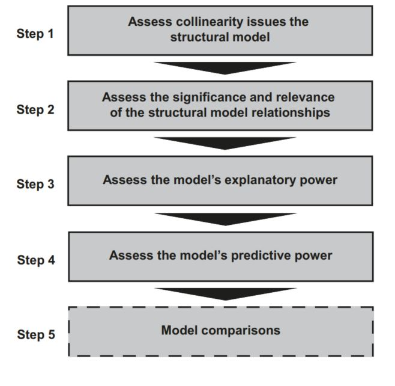
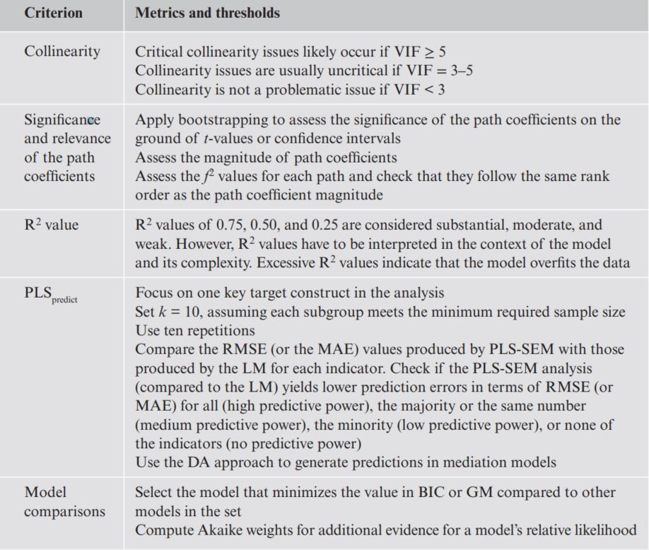

```{r setup, include=FALSE}
knitr::opts_chunk$set(echo = TRUE)
```

Here we should understand:

1. The steps involved in structural model assessment
2. The concept of explanatory power and how to evaluate it
3. How to use PLS_predict to assess a model’s predictive power
4. The concept of model comparison and metrics for selecting the best model
5. How to assess structural models using SEMinR

Once you have confirmed that the measurement of constructs is reliable and valid, the next step addresses the assessment of the structural model results


```{r echo=FALSE, out.width='100%'}
#knitr::include_graphics("D:/DataScience/stat_SEM/SEM_DA/imges/Structural model assessment procedure.JPG" )

```


In the first step, you need to examine the structural model for potential collinearity issues. The reason is that the estimation of path coefficients in the structural models is based on ordinary least squares (OLS) regressions of each endogenous construct on its corresponding predictor constructs. Just as in an OLS regression, the path coefficients might be biased if the estimation involves high levels of collinearity among predictor constructs. Once you have ensured that collinearity is not a problem, in second step you will evaluate the significance and relevance of the structural model relationships (i.e., the path coefficients). 

Steps 3 and 4 of the procedure involve examining the model’s explanatory power and predictive power. In addition, some research situations involve the computation and comparison of alternative models, which can emerge from different theories or contexts. PLSSEM facilitates the comparison of alternative models using established criteria, which are well known from the regression literature. As model comparisons are not relevant for every PLS-SEM analysis, Step 5 should be considered optional.

Model fit indices enable judging how well a hypothesized model structure fits the empirical data and are an integral part of any CB-SEM analysis.The notion of model fit as known from CB-SEM is not transferrable to PLS-SEM as the method follows a different aim when estimating model parameters (i.e., with the aim of maximizing the explained variance instead of minimizing the divergence between covariance matrices). Thus, structuralmodel assessment in PLS-SEM focuses on evaluating the model’s explanatory and predictive power.


# 1 Case Study Illustration:Structural Model Evaluation


Don't forget estimate the minimum sample size

```{r echo=FALSE}
library(seminr)
```

```{r}
load("data/corp_rep_data.rda")


corp_rep_mm_ext <- constructs(
composite("QUAL", multi_items("qual_", 1:8), weights = mode_B),
composite("PERF", multi_items("perf_", 1:5), weights = mode_B),
composite("CSOR", multi_items("csor_", 1:5), weights = mode_B),
composite("ATTR", multi_items("attr_", 1:3), weights = mode_B),
composite("COMP", multi_items("comp_", 1:3)),
composite("LIKE", multi_items("like_", 1:3)),
composite("CUSA", single_item("cusa")),
composite("CUSL", multi_items("cusl_", 1:3))
)


# Create structural model
corp_rep_sm_ext <- relationships(
paths(from = c("QUAL", "PERF", "CSOR", "ATTR"), to = c("COMP",
"LIKE")),
paths(from = c("COMP", "LIKE"), to = c("CUSA", "CUSL")),
paths(from = c("CUSA"), to = c("CUSL"))
)


# Estimate the model
corp_rep_pls_model_ext <- estimate_pls(
data = corp_rep_data,
measurement_model = corp_rep_mm_ext,
structural_model = corp_rep_sm_ext,
missing = mean_replacement,
missing_value = "-99")


# Summarize the results of the model estimation
summary_corp_rep_ext <- summary(corp_rep_pls_model_ext)


# Bootstrap the model
boot_corp_rep_ext <- bootstrap_model(
seminr_model = corp_rep_pls_model_ext,
nboot = 1000,
cores = parallel::detectCores(),
seed = 123)

# Summarize the results of the bootstrap
summary_boot_corp_rep_ext <- summary(boot_corp_rep_ext,alpha = 0.05)
```

## Step 1

We follow the structural model assessment procedure and begin with an evaluation of the collinearity of predictor constructs in relation to each endogenous construct. The corporate reputation model has four endogenous constructs , namely, COMP, LIKE, CUSA, and CUSL. We examine the VIF values for the predictor constructs by inspecting the vif_antecedents element within the summary_corp_rep_ext object:
```{r}
# Inspect the structural model collinearity VIF
summary_corp_rep_ext$vif_antecedents
```
all VIF values are clearly below the threshold of 5. However, QUAL’s VIF value (3.487) is above 3, suggesting the possibility of **collinearity problems**. Since the one exception is close to 3, we can conclude that collinearity among predictor constructs is likely not a critical issue in the structural model, and we can continue examining the result report

## Step 2

Next, in the structural model assessment procedure (Step 2 ), we need to evaluate the **relevance and significance** of the structural paths. The results of the bootstrapping of structural paths can be accessed by inspecting the bootstrapped_paths element nested in the summary_boot_corp_ext object

```{r}

# Inspect the structural paths
summary_boot_corp_rep_ext$bootstrapped_paths


```

First, let’s consider the original path coefficient estimates (column: Original Est.) for the exogenous driver constructs. For example, we find that QUAL has a strong positive impact on both COMP (0.430) and LIKE (0.380). A similar pattern of relationships emerges for PERF, but with lower effect sizes. On the contrary, CSOR exerts a much lower impact on these two constructs as evidenced in path coefficient estimates of 0.059 for COMP and 0.178 for LIKE. Similarly,ATTR has only a low impact on COMP and LIKE. Further analyzing the path coefficient estimates, we find that LIKE is the primary driver of both CUSA (0.436) and CUSL (0.344), as demonstrated by the larger path coefficients compared with
those of COMP

Let’s now review the results for statistical significance. Assuming a 5% significance level (as specified with the parameter alpha = 0.05 in the bootstrap_model() function), the t-values estimated from the bootstrapping should exceed the value of 1.960. We find that several relationships
are significant, including five of the exogenous driver construct relationships (QUAL→ COMP, t = 6.603; QUAL → LIKE, t = 5.699; PERF → COMP, t = 4.611; CSOR→ LIKE, t = 3.205; ATTR → LIKE, t = 2.573). At the same time, however, three of the exogenous driver relationships are not statistically significant (PERF → LIKE,t = 1.613; CSOR → COMP, t = 1.084; ATTR → COMP, t = 1.565). Reviewing the statistical significance of the path coefficients for the endogenous construct relationships, we see that four of the five paths are statistically significant. The one path
that is not significant is from COMP to CUSL (t = 0.104). These results suggest that companies should concentrate their marketing efforts on enhancing their likeability(by strengthening customers’ quality perceptions) rather than their perceived competence to maximize customer loyalty. This is not surprising, considering that customers rated mobile network operators. Since their services (provision of network capabilities) are intangible, affective judgments play a much more important role than cognitive judgments for establishing customer loyalty.


It is also important to consider the total effects to gain an idea of the impact of the four exogenous driver constructs on the outcome constructs CUSA and CUSL. To evaluate the total effects, we need to inspect the bootstrapped_total_paths element of summary_boot_corp_rep_ext

```{r}
# Inspect the total effects
summary_boot_corp_rep_ext$bootstrapped_total_paths
```
Of the four driver constructs, QUAL has the strongest total effect on CUSL(0.248), followed by CSOR (0.105), ATTR (0.101), and PERF (0.089). Therefore, it is advisable for companies to focus on marketing activities that positively influence the customers’ perception of the quality of their products and services(QUAL). As can be seen, all of QUAL’s total effects are significant at a 5% level.


## Step 3

In Step 3 of the structural model assessment procedure, we need to consider the model’s explanatory power by analyzing the R2 of the endogenous
constructs and the f2 effect size of the predictor constructs. 

To start with, we need to examine the R2 values of the endogenous constructs. 

```{r}
# Inspect the model RSquares
summary_corp_rep_ext$paths
```
The R2 values of COMP(0.631), CUSL (0.562), and LIKE (0.558) can be considered moderate, whereas the R2 value of CUSA (0.292) is weak. The weak R2 value of CUSA may be the result of this construct being measured as a single item. We recommend customer satisfaction always be measured as a multi-item construct


```{r}
# Inspect the effect sizes
summary_corp_rep_ext$fSquare  # out from row to col
```
shows the f^2 values for all combinations of endogenous constructs (represented by the columns) and corresponding exogenous (i.e., predictor)
constructs (represented by the rows). For example, LIKE has a medium effect size of 0.159 on CUSA and of 0.138 on CUSL. On the contrary, COMP has no effect on CUSA (0.018) or CUSL (0.000). The rank order of effect sizes is identical to the rank order on the grounds of the path coefficients


## Step 4

Step 4 in the structural model assessment procedure is the evaluation of the model’s predictive power. To do so, we first have to generate the predictions using the predict_pls() function. We run the PLS_predict procedure with k = 10 folds and ten repetitions and thus set noFolds = 10, and reps = 10. In addition, we use the predict_DA approach. Finally, we summarize the PLSpredict model and assign the output to the sum_predict_corp_rep_ext object:
```{r}
# Generate the model predictions
predict_corp_rep_ext <- predict_pls(
  model = corp_rep_pls_model_ext,
  technique = predict_DA,
  noFolds = 10,
  reps = 10)
# Summarize the prediction results
sum_predict_corp_rep_ext <- summary(predict_corp_rep_ext)
```

The distributions of the prediction errors need to be assessed to decide the best metric for evaluating predictive power. If the prediction error is highly skewed, the MAE is a more appropriate metric than the RMSE. In order to assess the distribution of predictive error, we use the plot() function on the object sum_predict_corp_rep_ext and specify the indicator argument to the indicators of interest. We should focus on the key outcome construct CUSL and evaluate the indicators cusl_1, cusl_2, and cusl_3. First, we set the number of plots to display in the output to three plots arranged horizontally using the par(mfrow=c(1,3)) command. Remember to set par(mfrow=c(1,1)) after outputting the plots;
otherwise, all future plots will be arranged horizontally in a sequence of three:
```{r}
# Analyze the distribution of prediction error
par(mfrow=c(1,3))
plot(sum_predict_corp_rep_ext,
indicator = "cusl_1")
plot(sum_predict_corp_rep_ext,
indicator = "cusl_2")
plot(sum_predict_corp_rep_ext,
indicator = "cusl_3")
par(mfrow=c(1,1))

```

The results in the Fig show that while all three plots have a left tail and are mildly skewed to the right, the prediction error distributions are rather symmetric.We should therefore use the RMSE for our assessment of prediction errors.We can investigate the RMSE and MAE values by calling the sum_predict_corp_rep_ext object.
```{r}
# Compute the prediction statistics
sum_predict_corp_rep_ext

```
Analyzing the CUSL construct’s indicators, we find that the PLS path model has lower out-of-sample predictive error (RMSE) compared to the
naïve LM model benchmark for all three indicators (sections: PLS out-of-sample metrics and LM out-of-sample metrics): cusl_1 (PLS, 1.192; LM, 1.228), cusl_2(PLS, 1.239; LM, 1.312), and cusl_3 (PLS, 1.312; LM, 1.380). Accordingly, we conclude that the model has a high predictive power.

## Step 5

model comparson,

come back soon...


# 2 Theories on Structural Model Evaluation

## 2.1 Assess Collinearity Issues of the Structural Model

This process is similar to assessing formative measurement models, but in this case, the construct scores of the predictor constructs in each regression in the structural model are used to calculate the variance inflation factor (VIF) values. VIF values above 5 are indicative of probable collinearity issues among predictor constructs, but collinearity can also occur at lower VIF values of 3–5. If collinearity is a problem, a frequently used option is to create **higherorder constructs**

## 2.2 Assess the Significance and Relevance of the Structural Model Relationships

Regarding significance of the path coefficients, it is analogous to the assessment of formative indicator weights. n terms of relevance, path coefficients are usually between −1 and +1, with coefficients closer to −1 representing strong negative relationships and those closer to +1 indicating strong positive relationships. Note that values below −1 and above +1 may technically occur, for instance, when collinearity is at very high levels. Path coefficients larger than +/−1 are not acceptable, and multicollinearity reduction methods must be implemented.


The research context is important when determining whether the size of a path coefficient is meaningful. Thus, when examining structural model results, researchers should also interpret total effects, defined as the sum of the direct effect (if any) and all indirect effects linking one construct to another in the model. The examination of total effects between constructs, including all their indirect effects, provides a more comprehensive picture of the structural model relationships (Nitzl, Roldán,& Cepeda Carrión, 2016)


## 2.3 Assess the Model’s Explanatory Power

It involves examining the coefficient of determination (R2) of the endogenous construct(s). The R2 represents the variance explained in each of the endogenous constructs and is a measure of the model’s explanatory power
(Shmueli & Koppius, 2011), also referred to as in-sample predictive power 


Researchers should also be aware that R2 is a function of the number of predictor constructs – the greater the number of predictor constructs, the higher the R2. Therefore, the R2 should always be interpreted relative to the context of the study, based on the R2 values from related studies as well as models of similar complexity. R2 values can also be too high when the model overfits the data. In case of model overfit, the (partial regression) model is too complex, which results in fitting the random noise inherent in the sample rather than reflecting the overall population. The same model would likely not fit on another sample drawn from
the same population (Sharma, Sarstedt, Shmueli, Kim, & Thiele, 2019). When measuring a concept that is inherently predictable, such as physical processes, R2 values of (up to) 0.90 might be plausible. 

However, similar R2 value levels in a model that predicts human attitudes, perceptions, and intentions would likely indicate model overfit (Hair, Risher, et al., 2019). A limitation of R2 is that the metric will tend to increase as more explanatory variables are introduced to a model. The adjusted R2 metric accounts for this by adjusting the R2 value based upon the number of explanatory variables in relation to the data size and is seen
as a more conservative estimate of R2 (Theil, 1961). But because of the correction factor introduced to account for data and model size, the adjusted R2 is not a precise indication of an endogenous construct’s explained variance (Sarstedt &Mooi, 2019; Chap. 7).


Researchers can also assess how the removal of a selected predictor construct affects an endogenous construct’s R2 value. This metric is the f2 effect size and is similar to the size of the path coefficients. More precisely, the rank order of the relevance of the predictor constructs in explaining a dependent construct in the structural model is often the same when comparing the size of the path coefficients and the f2 effect sizes. In such situations, the f2 effect size is typically only reported if requested by editors or reviewers. Otherwise (i.e., if the rank order of constructs’relevance in explaining a dependent construct in the structural model differs when comparing the size of the path coefficients and the f2 effect sizes), the researcher may report the f2 effect size to offer an alternative perspective on the results. In addition, some other research settings call for the reporting of effect sizes, such as in moderation analysis (Memon et al., 2019; see Chap. 7)


## 2.4 Assess the Model’s Predictive Power


predictive power, also referred to as out-of-sample predictive power
training process: k-fold CV

**MAE** and **RMSE** 

In comparing the RMSE (or MAE) values with the LM values, the following guidelines apply (Shmueliet al., 2019):

1. If all indicators in the PLS-SEM analysis have lower RMSE (or MAE) values compared to the naïve LM benchmark, the model has high predictive power.
2. If the majority (or the same number) of indicators in the PLS-SEM analysis yields smaller prediction errors compared to the LM, this indicates a medium predictive power.
3. If a minority of the dependent construct’s indicators produce lower PLS-SEM prediction errors compared to the naïve LM benchmark, this indicates the model has low predictive power.
4. If the PLS-SEM analysis (compared to the LM) yields lower prediction errors in terms of the RMSE (or the MAE) for none of the indicators, this indicates the model lacks predictive power

An important decision when using PLSpredict is how to generate the predictions when the PLS path model includes a mediator construct (mediation is discussed further in 7 Chap. 7), which is both a predictor to the outcome and itself the outcome of an antecedent. SEMinR offers two alternatives to generate predictions in such a model setup (Shmueli et al., 2016). Researchers can choose to generate predictions using either the direct antecedents (DAs) or the earliest antecedents (EAs).In the DA approach, PLSpredict would consider both the antecedent and the mediator as predictors of outcome constructs, whereas in the EA approach, the mediator
would be excluded from the analysis. Danks (2021) presents simulation evidence that the DA approach generates predictions with the highest accuracy. We therefore recommend using this approach.

thinking: how to set lables...


## 2.5 Model Comparisons


BIC, GM

cross-validated predictive ability test (CVPAT; Liengaard et al., 2021)

## Summary


```{r echo=FALSE, out.width='100%'}
#knitr::include_graphics("D:/DataScience/stat_SEM/SEM_DA/imges/Structural model assessment procedure.JPG" )

```


