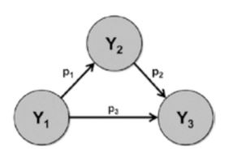
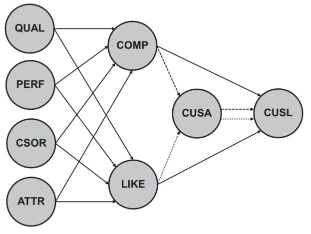

```{r setup, include=FALSE}
knitr::opts_chunk$set(echo = TRUE)
```

Here, we should:

1. Understand the basic concepts of mediation in a PLS-SEM context
2. Know how to execute a mediation analysis
3. Comprehend how to interpret the results
4. Learn to distinguish between a single and a multiple mediation analysis
5. Acquire the capability to use SEMinR to conduct a mediation analysis based on the corporate reputation example

# 1 Intro

Mediation occurs when a construct, referred to as mediator construct, intervenes between two other related constructs. More precisely, a change in the exogenous construct causes a change in the mediator construct, which, in turn, results in a change in the endogenous construct in the PLS path model. When such an effect is present, mediation can be a useful statistical analysis, if supported by theory and carried out properly.
```{r echo=FALSE, out.width='100%'}
#knitr::include_graphics("D:/DataScience/stat_SEM/SEM_DA/imges/Structural model assessment procedure.JPG" )

```
Consider the Fig for an illustration of a mediating effect in terms of direct and indirect effects. A direct effect describes the relationships linking two constructs with a single arrow. Indirect effects are those structural model paths that involve a sequence of relationships with at least one intervening construct involved. Thus, an indirect effect is a sequence of two or more direct effects and is represented visually by multiple arrows. . It shows both a direct effect p3 between Y1 and Y3 and an indirect effect of Y1 on Y3 in the form of a Y1 → Y2 → Y3 sequence. The
indirect effect, computed as the product p1 ∙ p2, represents the mediating effect of the construct Y2 on the relationship between Y1 and Y3. Finally, the sum of the direct and indirect effect is referred to as the total effect (i.e., p1 ∙ p2 + p3).


Many PLS path models include mediation effects but are often not explicitly hypothesized and tested (Hair et al., 2022). Only when the possible mediation is theoretically considered and also empirically tested is it possible to fully and accurately understand the nature of the cause–effect relationship. Again, theory is always the foundation of empirical analyses, including mediation. Nitzl, Roldán, and Cepeda Carrión (2016) as well as Cepeda Carrión, Nitzl, and Roldán (2017) and Memon, Cheah, Ramayah, Ting, and Chuah (2018) provide detailed explanations of mediation analysis in PLS-SEM.


# 2 Systematic Mediation Analysis

A systematic mediation analysis builds on a theoretically established model and hypothesized relationships, including the mediating effect. To begin, it is important to estimate and assess the model, which includes all considered mediators. The next steps are the characterization of the mediation analysis’ outcomes and testing of the mediating effects. 

## 2.1 Evaluation of the Mediation Model

Evaluating a mediation model requires all quality criteria of the measurement and structural models to be met. The analysis begins with the assessment of the reflective and formative measurement models. and then is the assessment of all structural model evaluation criteria.

## 2.2 Characterization of Outcomes

```{r echo=FALSE, out.width='100%'}
#knitr::include_graphics("D:/DataScience/stat_SEM/SEM_DA/imges/Structural model assessment procedure.JPG" )
knitr::include_graphics("imges/Mediation analysis procedure.JPG" )
```

## 2.3 Testing Mediating Effects


# 3 Multiple Mediation Models


# 4 Case Study Illustration: Mediation Analysis

Here, we expect that customer satisfaction mediates the relationship between likeability and customer loyalty as well as competence and customer loyalty
```{r echo=FALSE, out.width='100%'}
#knitr::include_graphics("D:/DataScience/stat_SEM/SEM_DA/imges/Structural model assessment procedure.JPG" )

```

To begin the mediation analysis, we need to ensure that all construct measures are reliable and valid and that the structural model meets all quality criteria.


We first need to test for significance of the relevant indirect effects in the extended corporate reputation model. The indirect effect from COMP via CUSA to CUSL is the product of the path coefficients from COMP to CUSA and from CUSA to CUSL (mediation path 1, dashed line). Similarly, the indirect effect from LIKE via CUSA to CUSL is the product of the path coefficients from LIKE to CUSA and from CUSA to CUSL (mediation path 2, dotted line). To test for significance of these path coefficients’ products, we first need to estimate and bootstrap the model and summarize the results 


```{r echo=FALSE}
library(seminr)
```


```{r}
load("data/corp_rep_data.rda")
# Create measurement model
corp_rep_mm_ext <- constructs(
composite("QUAL", multi_items("qual_", 1:8), weights = mode_B),
composite("PERF", multi_items("perf_", 1:5), weights = mode_B),
composite("CSOR", multi_items("csor_", 1:5), weights = mode_B),
composite("ATTR", multi_items("attr_", 1:3), weights = mode_B),
composite("COMP", multi_items("comp_", 1:3)),
composite("LIKE", multi_items("like_", 1:3)),
composite("CUSA", single_item("cusa")),
composite("CUSL", multi_items("cusl_", 1:3))
)

# Create structural model
corp_rep_sm_ext <- relationships(
paths(from = c("QUAL", "PERF", "CSOR", "ATTR"), to = c("COMP",
"LIKE")),
paths(from = c("COMP", "LIKE"), to = c("CUSA", "CUSL")),
paths(from = c("CUSA"), to = c("CUSL"))
)

# Estimate the model
corp_rep_pls_model_ext <- estimate_pls(
data = corp_rep_data,
measurement_model = corp_rep_mm_ext,
structural_model = corp_rep_sm_ext,
missing = mean_replacement,
missing_value = "-99"
)

# Summarize the results of the model estimation
summary_corp_rep_ext <- summary(corp_rep_pls_model_ext)

# Bootstrap the model
boot_corp_rep_ext <- bootstrap_model(
seminr_model = corp_rep_pls_model_ext,
nboot = 1000,
cores = parallel::detectCores(),
seed = 123
)
# Summarize the results of the bootstrap
summary_boot_corp_rep_ext <- summary(boot_corp_rep_ext, alpha =0.05)


```


The results for total indirect effects can be found by inspecting the total_indirect_effects element within the summary_corp_rep_ext object, summary_corp_rep_ext$total_indirect_effects. Specific indirect paths can be evaluated for significance, by using the specific_effect_significance() function. This function takes a bootstrapped model object, an antecedent construct name, and an outcome construct name as arguments and returns the bootstrap confidence interval for the total indirect paths from the antecedents to the outcome construct.

We use the specific_effect_significance() function on the boot_corp_rep_ext object and specify the indirect path using the from and to arguments. A separate path must be specified for COMP, through CUSA, to CUSL,and another for LIKE, through CUSA, to CUSL:


```{r}
# Inspect total indirect effects
summary_corp_rep_ext$total_indirect_effects
```


```{r}
# Inspect indirect effects
specific_effect_significance(boot_corp_rep_ext,
from = "COMP",
through = "CUSA",
to = "CUSL",
alpha = 0.05)
specific_effect_significance(boot_corp_rep_ext,
from = "LIKE",
through = "CUSA",
to = "CUSL",
alpha = 0.05)
```


......?


