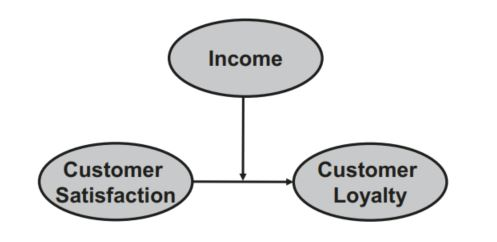

```{r setup, include=FALSE}
knitr::opts_chunk$set(echo = TRUE)
```

After reading this chapter, you should:

1. Comprehend the basic concepts of moderation when using PLS-SEM
2. Be able to technically execute a moderation analysis
3. Understand how to interpret the results of a moderation analysis
4. Learn how to execute a slope analysis
5. Be able to use SEMinR to conduct a moderation analysis based on the corporate
reputation example


# 1 Introduction

Moderation describes a situation in which the relationship between two constructs is not constant but depends on the values of a third variable, referred to as a moderator variable. The moderator variable (or construct) changes the strength, or even the direction of a relationship between two constructs in a model.

For example, prior research has shown that the relationship between customer satisfaction and customer loyalty differs as a function of the customers’ income or age (e.g.,Homburg & Giering, 2001). More precisely, income has a pronounced negative
effect on the satisfaction to loyalty relationship – the higher the income, the weaker the relationship between satisfaction and loyalty. In short, income serves as a moderator variable that accounts for heterogeneity in the data. This means the satisfaction to loyalty relationship is not the same for all customers but differs depending on the income level. In this respect, moderation can (and should) be seen as a means to account for heterogeneity in the data.

Moderating relationships are hypothesized a priori by the researcher. The testing of the moderating relationship depends on whether the researcher hypothesizes whether one specific model relationship or whether all model relationships depend on the values of the moderator. Moderators can be either single items or multiitem constructs. In our satisfaction–loyalty example, we hypothesized that only the satisfaction to loyalty relationship is influenced by income. These considerations also apply for the corporate reputation model and its relationship between CUSA and CUSL. In such a setting, we would, for example, examine if and how the respondents’ income influences the relationship between CUSA and CUSL.The Figure here shows the theoretical model of such a moderating relationship

```{r echo=FALSE, out.width='100%'}

```


Alternatively, we could also hypothesize that several relationships in the corporate reputation model depend on some customer characteristic, such as gender. In this case, we would run a multigroup analysis (Klesel, Schuberth, Niehaves, &Henseler, 2021). For a detailed explanation of multigroup analysis in PLS-SEM,see Chap. 8 in Hair et al. (2022) and Chap. 4 in Hair, Sarstedt,Ringle, and Gudergan (2018). Here, my focus is on the (single) moderator analysis. More specifically, we address the modeling and interpretation of an interaction effect that occurs when a moderator variable is assumed to influence one specific relationship


# 2 Types of Moderator Variables

Moderators can be present in structural models in different forms. They can represent **observable** traits, such as gender, age, or income. But they can also represent **unobservable** traits, such as risk attitude, attitude toward a brand, or ad liking.
Moderators can be measured with a single item or multiple items and using reflective or formative indicators. The most important differentiation, however, relates to the moderator’s measurement scale, which involves distinguishing between **categorical** (typically dichotomous) and **continuous** moderators

These categorical variables are usually dummy coded (i.e., 0/1),whereby the zero ("0") represents one of the two categories, called the reference category, while the value one ("1") represents the other category in a two-category situation. Similar to regression analysis, categorical moderators can be included in a PLS path model when specifying the structural model. Running a multigroup analysis enables identification of model relationships that differ significantly between the groups (Hair et al., 2018, Chap. 4). This approach offers a more complete picture of the moderator’s influence on the analysis results as the focus shifts from examining its impact on one specific model relationship to examining its impact on all model relationships.

In many situations, researchers have a continuous moderator variable that they theorize will affect the strength of one specific relationship between two latent variables. For example, we hypothesize that the relationship between satisfaction and loyalty is influenced by the customers’ income. If this income moderator effect is not present, we would assume the strength of the relationship between satisfaction and loyalty is constant.


Continuous moderators are typically measured with multi-item constructs but can,in principle, also be measured using only a single item. When the moderator variable represents some abstract unobservable trait (as opposed to some observable phenomenon, such as income), however, we clearly advise against the use of single items for construct measurement. In short, multi-item scales are much more effective in terms of explaining the target construct’s variance. more reasons in the ref-book. 

# 3 Modeling Moderating Effects


# 4 Creating the Interaction Term


# 5 Model Evaluation


# 6 Result Interpretation


# 7 Case Study Illustration: Moderation Analysis


```{r}
load("data/corp_rep_data.rda")


# Create the measurement model
corp_rep_mm_mod <- constructs(
composite("QUAL", multi_items("qual_", 1:8), weights = mode_B),
composite("PERF", multi_items("perf_", 1:5), weights = mode_B),
composite("CSOR", multi_items("csor_", 1:5), weights = mode_B),
composite("ATTR", multi_items("attr_", 1:3), weights = mode_B),
composite("COMP", multi_items("comp_", 1:3)),
composite("LIKE", multi_items("like_", 1:3)),
composite("CUSA", single_item("cusa")),
composite("SC", multi_items("switch_", 1:4)),
composite("CUSL", multi_items("cusl_", 1:3)),
interaction_term(iv = "CUSA", moderator = "SC", method = two_stage))


```

There are two new paths in the model: from SC to CUSL and from the interaction term CUSA*SC to CUSL. We therefore append the list with the two new construct names: 'paths(from = c("CUSA", "SC", "CUSA*SC")', to = c("CUSL")). 


```{r}

# Create the structural model
corp_rep_sm_mod <- relationships(
paths(from = c("QUAL", "PERF", "CSOR", "ATTR"), to = c("COMP",
"LIKE")),
paths(from = c("COMP", "LIKE"), to = c("CUSA", "CUSL")),
paths(from = c("CUSA", "SC", "CUSA*SC"), to = c("CUSL"))
)
# Estimate the new model with moderator
corp_rep_pls_model_mod <- estimate_pls(
data = corp_rep_data,
measurement_model = corp_rep_mm_mod,
structural_model = corp_rep_sm_mod,
missing = mean_replacement,
missing_value = "-99"
)
# Extract the summary
sum_corp_rep_mod <- summary(corp_rep_pls_model_mod)
# Bootstrap the model
boot_corp_rep_mod <- bootstrap_model(
seminr_model = corp_rep_pls_model_mod,
nboot = 1000)
# Summarize the results of the bootstrap
sum_boot_corp_rep_mod <- summary(boot_corp_rep_mod, alpha = 0.05)

```
```{r}
# Inspect the bootstrapped structural paths
sum_boot_corp_rep_mod$bootstrapped_paths

```

```{r}

# Simple slope analysis plot
slope_analysis(
moderated_model = corp_rep_pls_model_mod,
dv = "CUSL",
moderator = "SC",
iv = "CUSA",
leg_place = "bottomright")

```
